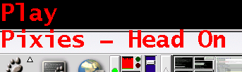
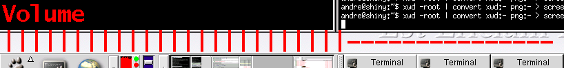

XOSD displays text on your screen, sounds simple right? The difference is it is unmanaged and shaped, so it appears transparent. This gives the effect of an On Screen Display, like your TV/VCR etc.. The package also includes an xmms plugin, which automatically displays various interesting things as they change (song name, volume etc...)

I haven't been involved in its development for over 15 years now, but a few places still link back there. I don't know what state it is in, but the home page is now [on SourceForge](https://sourceforge.net/projects/libxosd/)

## Other software which uses XOSD
* [Pike Bindings](http://modules.gotpike.org/module_info.html?module_id=41) - Bindings for usage under Pike
* [IR Exec OSD](http://irexecosd.sourceforge.net/) - infra red remote launcher which uses XOSD for display
* [OsdSH](http://sourceforge.net/projects/osdsh) - display clock, battery, connection and volume
* [OSD Clock](http://leftorium.net/software.phtml) - minimalist on screen clock
* [OSD Mail](http://www.hellion.org.uk/osd_mail) - mail notifier
* [PyOSD](http://repose.cx/pyosd/) - Python bindings for libxosd
* [OSDSens](http://sourceforge.net/projects/osdsens/) - monitors various system sensors and displays the results using XOSD
* [GaimOSD](http://gaimosd.sourceforge.net/) - a module for gaim which alerts you to events in the instant messenger
* [LispOSD](http://mtpforge.melting-pot.org/projects/lisposd) - Guile bindings for XOSD
* [OnscreenD](http://caladan.nanosoft.ca/onscreend.php) - a generic onscreen daemon for displaying error messages &amp; events
* [Go bindings](https://github.com/mischief/xosd)
